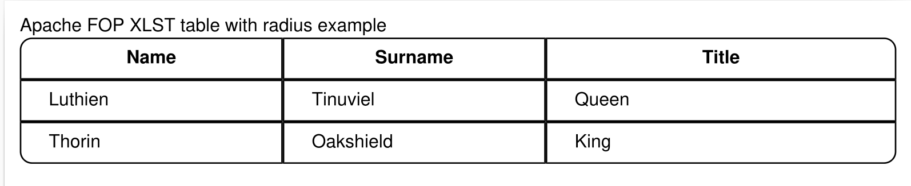

# venus-sample-pdf-fop-xslt

Venus Fugerit Doc sample showing the new custom XSL feature for mod-fop

This is a sample project configured using [fj-doc-maven-plugin init plugin](https://venusdocs.fugerit.org/guide/#maven-plugin-goal-init).

[](CHANGELOG.md)
[](https://sonarcloud.io/summary/new_code?id=fugerit79_venus-sample-pdf-fop-xslt)
[](https://sonarcloud.io/summary/new_code?id=fugerit79_venus-sample-pdf-fop-xslt)
[](https://opensource.org/licenses/MIT)
[](https://github.com/fugerit-org/fj-universe/blob/main/CODE_OF_CONDUCT.md)

This project is part of a series of mini tutorial on [Venus Fugerit Doc](https://github.com/fugerit-org/fj-doc),
here you can find the [other tutorials](https://github.com/fugerit79/venus-sample-index).

## Requirement

* JDK 8+ (*)
* Maven 3.8+

(*) Currently FOP not working on [JDK 25, See bug JDK-8368356](https://bugs.openjdk.org/browse/JDK-8368356).

## Project initialization

This project was created with [Venus Maven plugin](https://venusdocs.fugerit.org/guide/#maven-plugin-goal-init)

```shell
mvn org.fugerit.java:fj-doc-maven-plugin:8.17.2:init \
-DgroupId=org.fugerit.java.demo \
-DartifactId=venus-sample-pdf-fop-xslt \
-Dextensions=base,freemarker,mod-fop \
-DaddJacoco=true \
-DaddJacoco=addFormatting=true \
-DwithCI=github \
-Dflavour=vanilla
```

## Mod FOP XSLT Processing

### Example with custom XLST to add the *keep-together.within-page* attribute

We need to add the [mod-fop-xslt-path](https://venusdocs.fugerit.org/guide/#doc-handler-mod-fop-xslt-path) attribute : 

```xml
<info name="mod-fop-xslt-path">venus-sample-pdf-fop-xslt/fop-xslt/xslt-sample.xsl</info>
```

Optionally set the [mod-fop-xslt-debug](https://venusdocs.fugerit.org/guide/#doc-handler-mod-fop-xslt-debug) attribute :

```xml
<info name="mod-fop-xslt-debug">true</info>
```

In our document there are two tables. The second one is not fitting the page.

Our XSLT template : 

```xml
<?xml version="1.0" encoding="UTF-8"?>
<xsl:stylesheet version="1.0"
                xmlns:xsl="http://www.w3.org/1999/XSL/Transform"
                xmlns:fo="http://www.w3.org/1999/XSL/Format">

    <xsl:output method="xml" indent="yes" encoding="UTF-8"/>

    <!-- Identity template - copies everything as-is -->
    <xsl:template match="@*|node()">
        <xsl:copy>
            <xsl:apply-templates select="@*|node()"/>
        </xsl:copy>
    </xsl:template>

    <!-- Specific template for elements with id="end-element" -->
    <xsl:template match="*[@id='end-element']">
        <xsl:copy>
            <!-- Copy existing attributes -->
            <xsl:apply-templates select="@*"/>
            <!-- Add the keep-together attribute -->
            <xsl:attribute name="keep-together.within-page">always</xsl:attribute>
            <!-- Copy child nodes -->
            <xsl:apply-templates select="node()"/>
        </xsl:copy>
    </xsl:template>

</xsl:stylesheet>
```

Will add the attribute *keep-together.within-page* to the resulting XSLT : 

```xml
<xsl:attribute name="keep-together.within-page">always</xsl:attribute>
```

### Example with custom XLST to add corner radius to the table

This example demonstrates how to use Apache FOP extensions (`fox:*` namespace properties) to add rounded corners 
to table elements through custom XSLT transformations.

#### Overview

This feature combines:
- **FreeMarker template** with custom cell IDs for corner cells
- **Custom XSLT stylesheet** that applies Apache FOP border-radius properties
- **Apache FOP rendering** that interprets the border-radius directives

#### FreeMarker Template Configuration

Enable XSLT processing in the document metadata by using the `xslt-sample-table-with-radius.xsl` stylesheet:

```xml
<#if enableXslt!false >
    <info name="mod-fop-xslt-path">venus-sample-pdf-fop-xslt/fop-xslt/xslt-sample-table-with-radius.xsl</info>
    <info name="mod-fop-xslt-debug">${(debugXslt!false)?string('true', 'false')}</info>
</#if>
```

#### Table Structure with Corner Cell IDs

Define your table with special IDs on the corner cells that will receive border-radius styling:

```xml
<table columns="3" colwidths="30;30;40" width="100" id="data-table">
    <row header="true">
        <cell id="top-left-border"><para>Header 1</para></cell>
        <cell><para>Header 2</para></cell>
        <cell id="top-right-border"><para>Header 3</para></cell>
    </row>
    <!-- Data rows -->
    <!-- For the last row, dynamically assign bottom corner IDs: -->
    <cell id="bottom-left-border"><para>Data</para></cell>
    <!-- ... middle cells ... -->
    <cell id="bottom-right-border"><para>Data</para></cell>
</table>
```

#### XSLT Stylesheet for Border Radius

The stylesheet applies Apache FOP border-radius extensions to:
1. **Main table** (`id="data-table"`): Apply overall `fox:border-radius="8pt"`
2. **Corner cells**: Apply specific corner radii:
   - `fox:border-before-start-radius` (top-left)
   - `fox:border-before-end-radius` (top-right)
   - `fox:border-after-start-radius` (bottom-left)
   - `fox:border-after-end-radius` (bottom-right)

Key sections of `xslt-sample-table-with-radius.xsl`:

```xml
<!-- Main table styling -->
<xsl:template match="fo:table[@id='data-table']">
    <xsl:copy>
        <xsl:apply-templates select="@*[name() != 'border-separation']"/>
        <xsl:attribute name="fox:border-radius">8pt</xsl:attribute>
        <xsl:apply-templates select="node()"/>
    </xsl:copy>
</xsl:template>

<!-- Top-left corner cell -->
<xsl:template match="*[@id='top-left-border']">
    <xsl:copy>
        <xsl:apply-templates select="@*"/>
        <xsl:attribute name="fox:border-before-start-radius">8pt</xsl:attribute>
        <xsl:apply-templates select="node()"/>
    </xsl:copy>
</xsl:template>

<!-- Similar templates for other corners: top-right-border, bottom-left-border, bottom-right-border -->
```

#### Test Execution

The `TestFopTableWithRadius` test class demonstrates direct Apache FOP processing:

- **Input**: FO XML file at `src/test/resources/fo-sample/table-with-radius.fo`
- **Processing**: Transforms the FO document to PDF using Apache FOP's transformer
- **Output**: PDF file at `target/table-with-radius.pdf`

Run the test with:

```shell
mvn test -Dtest=TestFopTableWithRadius
```

#### Apache FOP Directives

- **`fox:border-radius`**: Sets uniform border radius on all four corners
- **`fox:border-before-start-radius`**: Top-left corner
- **`fox:border-before-end-radius`**: Top-right corner
- **`fox:border-after-start-radius`**: Bottom-left corner
- **`fox:border-after-end-radius`**: Bottom-right corner

**Note**: These `fox:*` properties are Apache FOP-specific extensions and require Apache FOP for rendering.


